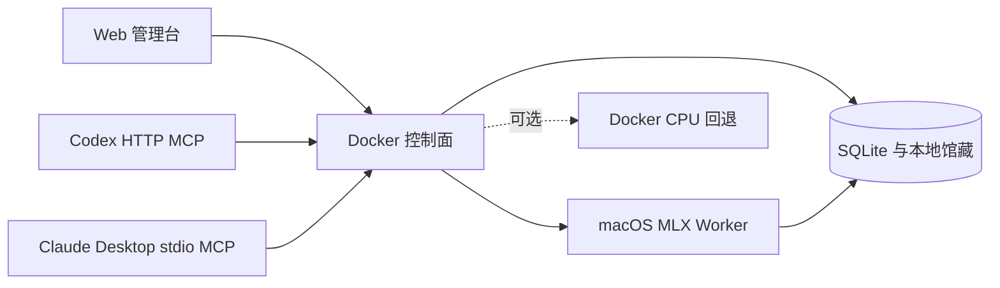

# VideoRecover

VideoRecover 是一套面向 Apple Silicon Mac 的本地抖音视频归档工具。粘贴一条公开抖音视频链接后，它会在后台下载最高可用画质的视频，保存发布文案，并用 Whisper 提取语音，生成 TXT、SRT 和 Markdown。

它提供 Web 管理台、REST API 和一组相同数据源的 MCP 工具：Codex 通过本机 Streamable HTTP 连接，Claude Desktop 通过 Docker stdio 连接。所有馆藏默认只保存在你的 Mac。

> 请只归档你有权保存和处理的内容，并遵守平台条款、版权和当地法律。本项目不会绕过 DRM、验证码或访问控制。

## 架构



- Docker 常驻控制面负责解析、下载、Web、API、MCP 和持久化。
- macOS LaunchAgent 在宿主机运行 MLX Whisper，能够使用 Apple GPU/统一内存。
- Worker 单任务运行、空闲十分钟后卸载模型；Docker 无法直接使用 Metal。
- CPU 回退默认关闭。启用时也会先给原生 Worker 五分钟的优先窗口。

## 准备

- Apple Silicon Mac（M1 或更新；M5 / 32GB 很合适）
- Docker Desktop
- macOS 自带的 `openssl`、`curl` 和 `launchctl`
- 宿主机 `ffmpeg`（没有时执行 `brew install ffmpeg`）
- 安装 MLX Worker 时需要 Python 3.12 或更新版本
- 首次构建和首次模型下载需要联网；建议预留至少 10GB 可用空间

## 一键启动

```bash
git clone git@github.com:codesfly/video_recover.git
cd video_recover
./scripts/dev-up.sh
```

脚本会：

1. 生成本机专用的 64 个十六进制字符（256-bit）Worker Token；
2. 把 `data` 目录转换为绝对路径；
3. 先完整构建新镜像，再替换运行中的容器；
4. 检查容器健康、Web 和 MCP 初始化。

打开 [http://127.0.0.1:8787](http://127.0.0.1:8787)。服务只监听回环地址，不暴露到局域网。

停止服务但保留所有数据：

```bash
./scripts/dev-down.sh
```

## 安装原生 MLX Worker

控制面启动后执行：

```bash
./scripts/install-mac-worker.sh
```

安装器会在 `~/Library/Application Support/VideoRecover/worker-venv` 创建独立环境，并注册 `com.codesfly.video-recover.worker` LaunchAgent。它登录后自动启动，以 `Background` 进程和较低 I/O/CPU 优先级运行。

首次转写会下载 `mlx-community/whisper-large-v3-turbo`，时间取决于网络。模型缓存位于：

```text
~/Library/Application Support/VideoRecover/models
```

查看状态和日志：

```bash
launchctl print gui/$(id -u)/com.codesfly.video-recover.worker
tail -f ~/Library/Logs/VideoRecover/worker.error.log
```

卸载 Worker（保留模型和馆藏）：

```bash
./scripts/uninstall-mac-worker.sh
```

## 使用 Web 管理台

1. 粘贴 `https://www.douyin.com/video/...` 或受支持的抖音短链接。
2. 保持“提取视频语音文案”选中。
3. 点击“开始归档”；页面会自动轮询进度。
4. 完成后可播放 MP4、复制发布原文/语音文案，或下载 TXT、SRT、Markdown、JSON。

同一规范化视频链接会复用已有任务，避免重复下载。

### 页面要求 Cookie 时

某些公开视频也会被抖音要求登录。请在已登录的浏览器中打开该视频，用开发者工具查看发往 `www.douyin.com` 的请求，在 Request Headers 中复制完整 `Cookie` 值，然后粘贴到管理台“抖音访问凭据”。

- 不要截图 Cookie，不要发到聊天或提交到 Git。
- Cookie 使用 Fernet 加密后写入 SQLite；密钥文件权限为 `0600`。
- API 和 Web 永远不会回显 Cookie 明文。
- 保存后重试原任务即可。

### Agent 使用登录态 Chrome 时

浏览器自动化必须遵守凭据边界：Agent 可以确认登录状态、读取当前页面可见的作者/描述，以及下载页面已经加载的媒体，但不能读取或导出 Chrome Cookie、Local Storage、密码或会话文件。

如果 Agent 能把当前页面媒体保存到宿主机的 `data/browser-capture/`，可用容器内的安全导入命令接管任务。导入器只接受该目录中的非空文件，拒绝任意本机路径，并会复用原先 `cookie_required` / `partial` 任务：

```bash
docker compose exec -T app video-recover-import \
  --url 'https://www.douyin.com/video/7662212894569811235' \
  --file '/data/browser-capture/7662212894569811235.mp4' \
  --description '页面可见的发布描述' \
  --author '页面可见的作者' \
  --duration 19.9
```

命令只导入已经在本机落盘的媒体，不接受远端任意 URL，不读取 Cookie，也不会绕过验证码。必须在容器内运行，确保 SQLite 中保存的是跨 Docker/macOS Worker 可解析的 `/data` 路径。

## 本地产物

每个视频位于 `${VIDEO_RECOVER_DATA_DIR}/downloads/<aweme_id>/`：

```text
video.mp4          视频
metadata.json      视频 ID、作者、片长、发布描述等
description.txt    发布原文
transcript.txt     语音文案
transcript.srt     带时间轴字幕
transcript.md      发布原文与分段语音合集
```

SQLite、密钥和缓存也位于同一数据根目录。不要只复制 `downloads` 作为完整备份。

## MCP：Codex 与 Claude Desktop

预览将写入的配置：

```bash
./scripts/install-mcp.sh
```

确认后安装：

```bash
./scripts/install-mcp.sh --apply
```

Codex 使用：

```bash
codex mcp add video-recover --url http://127.0.0.1:8787/mcp
codex mcp get video-recover
```

Claude Desktop 使用本地 stdio：安装脚本会备份并合并
`~/Library/Application Support/Claude/claude_desktop_config.json`，随后需要重启 Claude Desktop。

两个客户端只暴露以下七个安全工具：

- `submit_video`
- `get_task`
- `list_videos`
- `get_metadata`
- `get_transcript`
- `retry_task`
- `get_service_status`

Cookie 写入和删除馆藏不会暴露给 Agent，只能由 Web/REST 完成。

## 性能与资源

Docker 控制面空闲时主要是 FastAPI、SQLite 和轮询线程，CPU 占用通常接近空闲；Docker Desktop 本身仍有固定虚拟机开销。Compose 上限为 4 CPU 和 8GB 内存，防止 CPU 回退影响整机。

MLX 只在转写任务期间占用较多 GPU/统一内存，十分钟无任务后卸载。32GB Mac 可以正常保留充足前台空间；实际峰值取决于视频长度、模型和其他应用。

如果更看重低资源占用，保持：

```dotenv
VIDEO_RECOVER_CPU_FALLBACK_ENABLED=false
VIDEO_RECOVER_MODEL_IDLE_SECONDS=600
```

需要 Mac Worker 离线时自动使用 Docker CPU 才改为 `true`，然后运行 `./scripts/dev-up.sh`。CPU 转写明显更慢，也更占持续 CPU。

## 日常运维

健康与日志：

```bash
./scripts/dev-check.sh
docker compose ps
docker compose logs -f --tail=100 app
```

更新：

```bash
git pull --ff-only
./scripts/dev-up.sh
./scripts/install-mac-worker.sh
```

`dev-up.sh` 总是先构建镜像，构建失败不会替换在线容器。

备份：

```bash
docker compose stop app
cp -R data "data-backup-$(date +%Y%m%d)"
docker compose start app
```

恢复时关闭服务，用备份替换整个数据目录，再启动。删除 Web 馆藏是永久操作；会同时删除该任务数据库记录和对应文件。

## 故障排查

| 现象 | 原因与处理 |
|---|---|
| 提示需要 Cookie | 在 Web 中更新 Cookie，再对失败任务点“重新处理”。 |
| `parser_changed` | 抖音页面结构可能更新；先更新项目和镜像，仍失败再提交脱敏问题。 |
| Web 显示等待 MLX Worker | 运行安装脚本，检查 `launchctl print` 和 Worker 日志；确认 Docker 已启动。 |
| 首次转写长时间无进度 | 通常在下载模型；检查 Worker 日志、网络和模型目录剩余空间。 |
| Agent 不能读取 Chrome Cookie | 这是凭据安全边界；在 Web 手动保存 Cookie，或让 Agent 将已加载媒体保存到 `data/browser-capture/` 后使用安全导入命令。 |
| 磁盘空间不足 | 清理其他文件或安全删除不需要的馆藏；系统会在低于保留阈值时停止下载。 |
| Docker 占用持续偏高 | 保持 CPU 回退关闭；在 Docker Desktop 中检查是否有其他容器运行。 |
| MCP 连接失败 | 先运行 `./scripts/dev-check.sh`；Codex URL 必须是 `/mcp`，Claude Desktop 配置后需重启。 |
| 下载中断 | 下载器会使用 HTTP Range 从临时文件续传；在 Web 重试任务。 |

## 开发与验证

```bash
python3 -m venv .venv
.venv/bin/pip install -e '.[dev]'
.venv/bin/python -m pytest -m 'not live and not mac_live' -q
.venv/bin/ruff check .
bash -n scripts/*.sh
docker compose config -q
```

针对提供的视频做真实验收（会实际下载和转写）：

```bash
VIDEO_RECOVER_LIVE=1 .venv/bin/python -m pytest tests/e2e/test_live_douyin.py -m live -q -s
```

设计说明与完整实施计划位于 `docs/superpowers/`。
